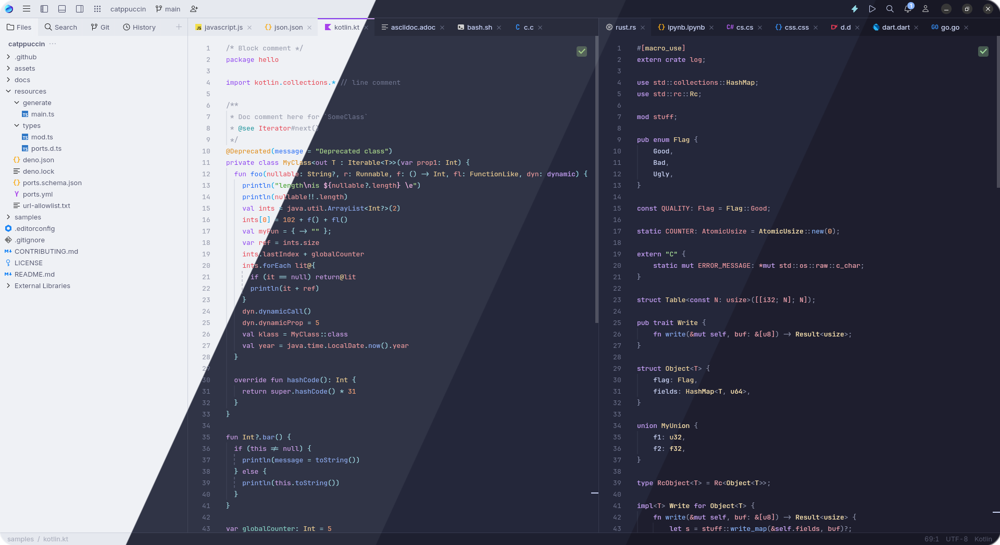
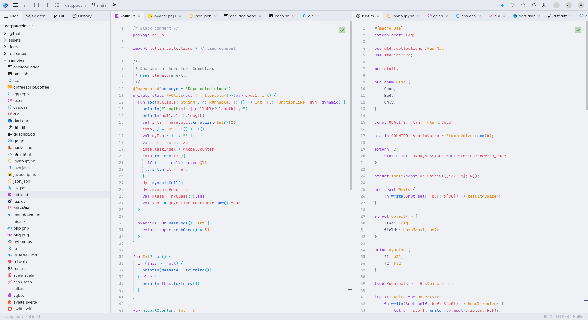
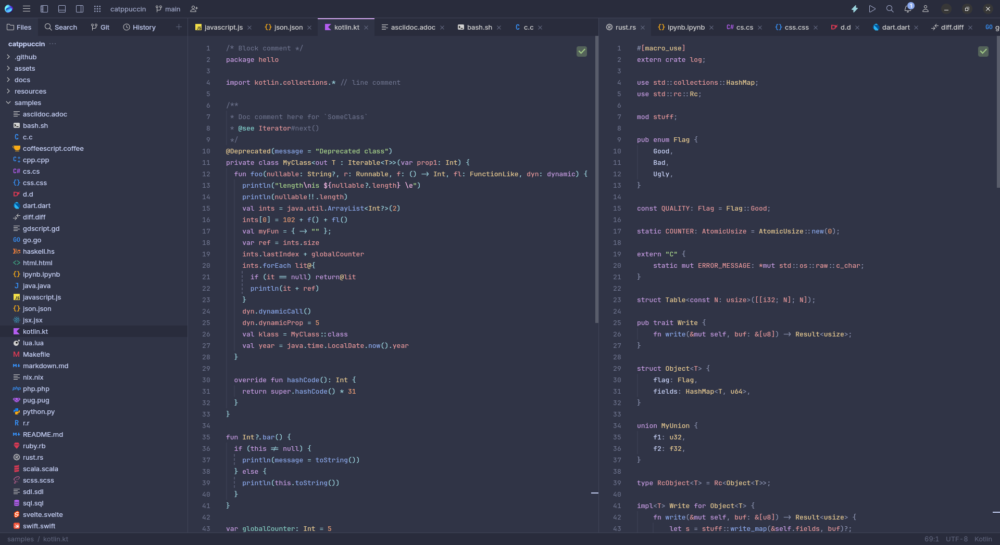
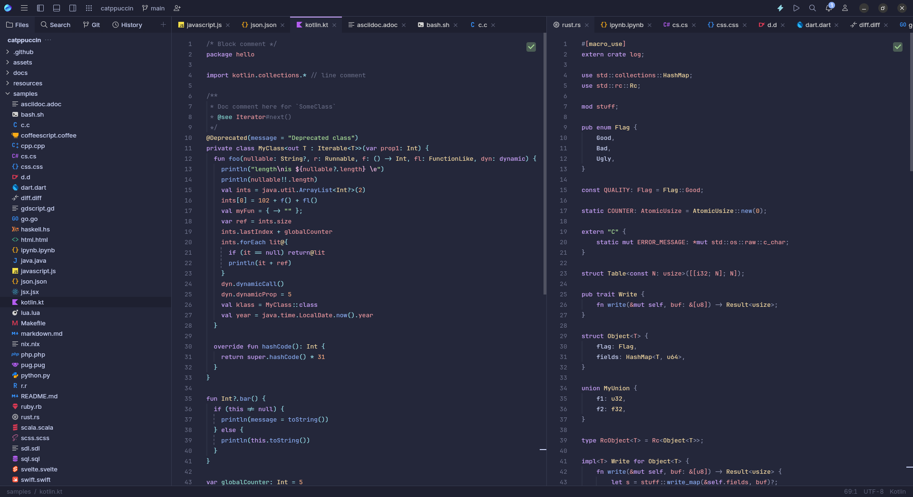
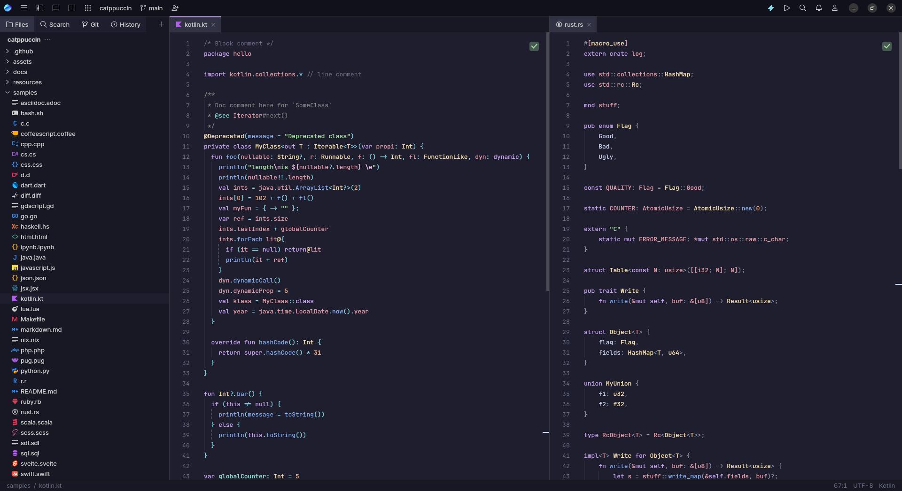

<h3 align="center">
	 
	
	Catppuccin for <a href="https://jetbrains.com/fleet">JetBrains Fleet</a>
	
</h3>

	
	
	

	

## Previews

🌻 Latte

🪴 Frappé

🌺 Macchiato

🌿 Mocha

## Installation and usage

1. Open the plugins page (`⚙`️→ `Plugins`)
2. Search for **"Catppuccin Fleet Theme"** and press `Add Globally`
3. Select your desired theme! (`⚙`️→ `Themes`)

> [!IMPORTANT]  
> You cannot have any files in your Fleet themes folder named `catppuccin-*.json`
> (where \* stands for any string of characters) or the plugin will fail to load.
>
> You can find the appropriate path to the folder depending on your system
> [here](https://www.jetbrains.com/help/fleet/color-themes.html#location)

## Contributing

See https://github.com/catppuccin/whiskers and the `fleet.tera` file

## 💝 Thanks to

- [Krypton](https://github.com/kkrypt0nn)
- [davfsa](https://github.com/davfsa)

&nbsp;

	

	Copyright &copy; 2021-present <a href="https://github.com/catppuccin" target="_blank">Catppuccin Org</a>

	

